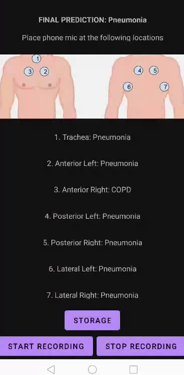

**Publication**  
T. T. Oishee, J. Anjom, U. Mohammed, and Md. I. A. Hossain, “Leveraging deep edge intelligence for real-time respiratory disease detection,” Clinical eHealth, Jan. 2025, doi: 10.1016/j.ceh.2025.01.001  

**Abstract**  
Detecting respiratory diseases such as COPD, bronchiolitis, URTI, and pneumonia is crucial for early medical intervention. This study utilizes the ICBHI dataset to train and evaluate deep learning architectures such as CNN-GRU, VGGish, YAMNet, CNN-LSTM, and basic CNN to automate this process. After a detailed analysis of the performance of these models, the CNN-LSTM model achieved an impressive accuracy and F1 score of 96% each. The model is also considerably lightweight, as its weights are further pruned and then quantized using TensorFlow Lite (TFLite), with the model being optimized at a significantly small size of 0.38 MB with only a loss of about 1% in performance. Subsequently, this was deployed to the smartphone application RespiScan. The application uses the prediction capabilities of the disease detection model on patients’ audio recordings. By providing a portable, cost-effective, and efficient, lightweight solution for respiratory health monitoring, this work contributes significantly to timely disease detection. It promotes proactive health management, thereby reducing the burden on healthcare systems. This work can be further validated in real-world conditions, such as for initial preliminary auscultation purposes, to ensure the proposed work’s efficacy across different environmental settings.  

**Dataset**  
https://bhichallenge.med.auth.gr/ICBHI_2017_Challenge

**RespiScan Application**  

